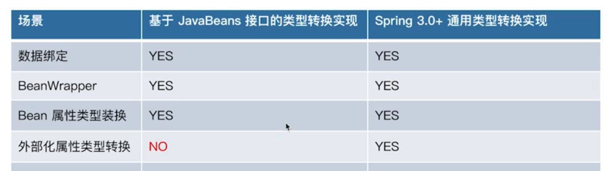
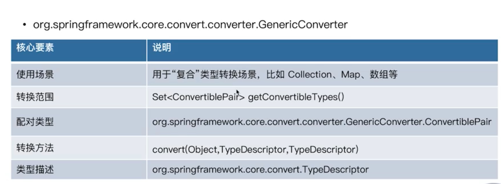
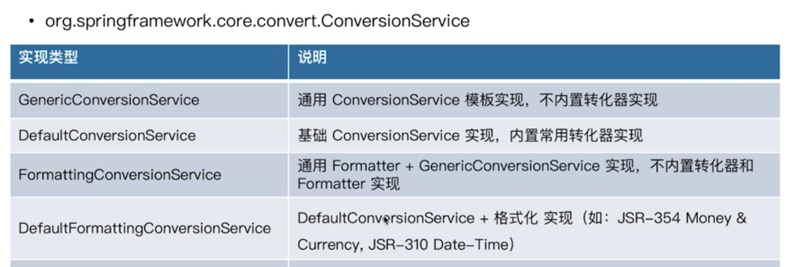

# Spring 类型转换

Spring中有2中方式的类型转换:
- 基于Java Beans的PropertyEditor进行的扩展
- Spring 3.0+加入的通用类型转换

## 基于Java Beans的PropertyEditor进行的扩展

基于String文本转化为其他类型, 可以通过PropertyEditorSupport进行扩展.

流程:
1. java.beans.PropertyEditor#setAsText 将String文本转化为指定类型的对象
2. java.beans.PropertyEditor#setValue 保存转化后的对象
3. 调用方通过java.beans.PropertyEditor#getValue 获取转化后的对象

Spring的内建扩展都在org.springframework.beans.propertyeditors包下.
Spring通过PropertyEditorRegistrar将PropertyEditor注册到PropertyEditorRegistry中, 
这些PropertyEditor都会在BeanWrapper中使用.

## Spring 3.0+加入的通用类型转换

实现Converter的接口:
- org.springframework.core.convert.converter.Converter<S, T>, 针对单一类型的转化
- org.springframework.core.convert.converter.ConverterFactory, 获取Converter
- org.springframework.core.convert.converter.GenericConverter, 
针对复合类型的转化, 比如Collection, Map, 数组之类
- org.springframework.core.convert.converter.ConditionalGenericConverter

注册转换器:
- org.springframework.core.convert.ConversionService, 管理所有注册的Converter以及GenericConverter
- org.springframework.context.support.ConversionServiceFactoryBean

注册转换器的名字必须为**conversionService**, ApplicationContext启动时BeanFactory会加载它, 
并将它传递给BeanWrapperImpl.

类型转换器底层接口:
- org.springframework.beans.TypeConverter
- org.springframework.beans.TypeConverterSupport, 扩展了PropertyEditorSupport
- org.springframework.beans.TypeConverterDelegate

